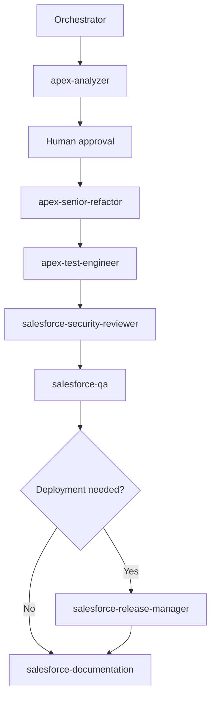
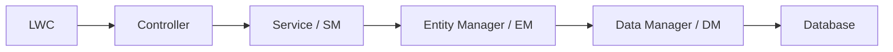

# Apex Refactoring Workflow

## Purpose

Use dedicated Apex agents to analyze, refactor, test, review, and document Apex cleanup work without changing business behavior or bypassing approval gates.

## Workflow steps

1. Start with `salesforce-orchestrator`.
2. `apex-analyzer` produces a read-only analysis report.
3. Human approves refactoring scope.
4. `apex-senior-refactor` applies minimal safe edits.
5. `apex-test-engineer` hardens or creates tests.
6. `salesforce-security-reviewer` validates security-sensitive concerns.
7. `salesforce-qa` validates preserved behavior and scope control.
8. `salesforce-release-manager` prepares deployment artifacts if deployment is needed.
9. `salesforce-documentation` records the final result.

## Mermaid flow



## Agent responsibilities

- `apex-analyzer`: read-only analysis, dependency mapping, metrics, and risk scoring.
- `apex-senior-refactor`: safe, minimal Apex refactors after ACT MODE approval.
- `apex-test-engineer`: behavior-focused test creation and hardening.
- `salesforce-security-reviewer`: sharing, CRUD/FLS, dynamic SOQL, `@AuraEnabled`, and data exposure review.
- `salesforce-qa`: regression, scope, and validation review.

## Layered Apex Refactoring / DML Separation

Controllers should remain thin because they are LWC-facing API facades, not the place for persistent data access or heavy orchestration.

- DML belongs in DM because data access should be centralized, bulk-safe, and reusable.
- Business logic belongs in Service or SM because orchestration should stay separate from transport concerns.
- Object-specific queries and aggregations belong in EM or DM depending on whether the logic is business-shaped or pure data access.
- Wrapper property names must stay stable because LWC JSON contracts are part of the public interface.

### DML separation flow

1. Analyzer identifies DML or complex SOQL in the controller.
2. Analyzer finds existing DM, EM, and SM or Service classes.
3. Human approves the target architecture.
4. Refactor agent moves DML to DM and orchestration to Service.
5. Test engineer updates tests.
6. Security reviewer checks permissions and sharing.
7. QA verifies unchanged behavior.

## Layered architecture diagram



## Copy-paste prompts

### Start Apex refactoring

```text
Use salesforce-orchestrator.
We are starting an Apex refactoring task.
Target class: [ClassName]
Reason: [Reason]
Start with apex-analyzer only.
Do not modify code. Do not deploy.
```

### Approve refactor

```text
Use apex-senior-refactor.
ACT MODE approved.
Use the analyzer report at [path].
Refactor [ClassName] only within the approved scope.
Do not change business logic, public/global signatures, @AuraEnabled wrapper properties, or field/object API names.
Do not deploy.
```

### Run test hardening

```text
Use apex-test-engineer.
Create or improve tests for [ClassName] after refactoring.
Cover nominal, null, empty, bulk, exception, and permission scenarios where applicable.
Do not deploy.
```

### Run security review

```text
Use salesforce-security-reviewer.
Review the Apex refactor for sharing, CRUD/FLS, dynamic SOQL, @AuraEnabled exposure, and data leakage.
Do not modify files.
```

### Run QA

```text
Use salesforce-qa.
Validate the Apex refactor.
Confirm public signatures unchanged, behavior preserved, tests pass, and scope did not expand.
```

### Prepare release

```text
Use salesforce-release-manager in RELEASE MODE.
Prepare deployment order, rollback notes, and release risks for the approved Apex refactor only.
Do not deploy.
```
