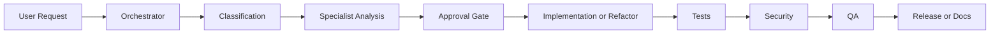

# Salesforce Codex MCP V2 Workflow

## Purpose

Define a controlled Salesforce delivery workflow using Codex agents, reusable skills, and Salesforce DX MCP discovery.

## Core Model

- Orchestrator is the single front door.
- Every prompt is work intake.
- Specialist agents are internal workers.
- Safe phases can continue automatically.
- Unsafe phases stop at approval gates.

## Workflow Diagram

## End-to-End Flow

1. User submits one prompt.
2. `salesforce-orchestrator` classifies the request.
3. The orchestrator applies specialist behavior internally.
4. Safe read-only phases continue automatically.
5. Unsafe work stops until explicit approval.
6. After approval, implementation/refactor continues.
7. Tests, security, QA, and docs follow automatically where relevant.

## Safe Phases

- file reading
- file search
- metadata discovery
- analysis
- planning
- report creation
- read-only security review
- read-only QA review
- documentation drafts

## Approval Gates

Unsafe work requires approval:

- code edits
- metadata creation
- deployment
- destructive changes
- public contract changes
- new architecture class creation
- sharing/security behavior changes
- transaction behavior changes

## Workflow Variants

- General Question / Explanation
- New Salesforce Feature
- Bug Fix
- Apex Refactoring
- Apex Layered Refactoring / DML Separation
- Performance Investigation
- Security Review
- QA Validation
- Release Preparation
- Documentation Only
